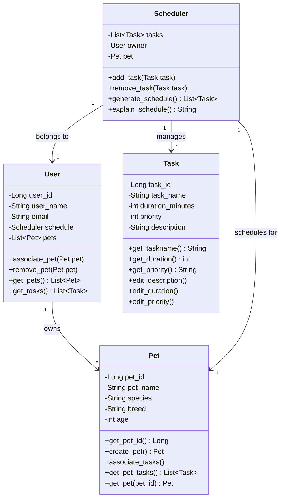

# PawPal+ Class Diagram

```mermaid
classDiagram
    class Pet {
        -Long pet_id
        -String pet_name
        -String species
        -String breed
        -int age
        +get_pet_id() Long
        +create_pet() Pet
        +associate_tasks()
        +get_pet_tasks() List~Task~
        +get_pet(pet_id) Pet
    }
    
    class User {
        -Long user_id
        -String user_name
        -String email
        -Scheduler schedule
        -List~Pet~ pets
        +associate_pet(Pet pet)
        +remove_pet(Pet pet)
        +get_pets() List~Pet~
        +get_tasks() List~Task~
    }
    
    class Task {
        -Long task_id
        -String task_name
        -int duration_minutes
        -int priority
        -String description
        +get_taskname() String
        +get_duration() int
        +get_priority() String
        +edit_description() 
        +edit_duration() 
        +edit_priority()
    }
    
    class Scheduler {
        -List~Task~ tasks
        -User owner
        -Pet pet
        +add_task(Task task)
        +remove_task(Task task)
        +generate_schedule() List~Task~
        +explain_schedule() String
    }
    
    User "1" --> "*" Pet : owns
    Scheduler "1" --> "1" User : belongs to
    Scheduler "1" --> "*" Task : manages
    Scheduler "1" --> "1" Pet : schedules for
```
